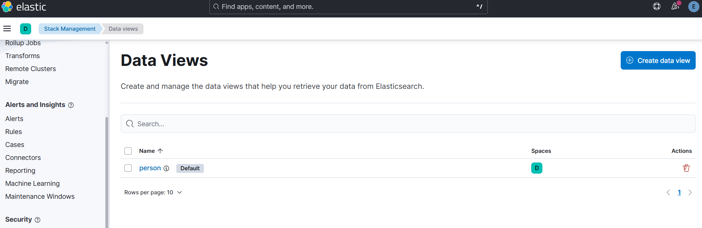
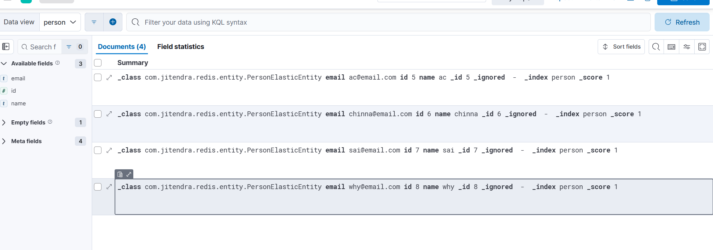
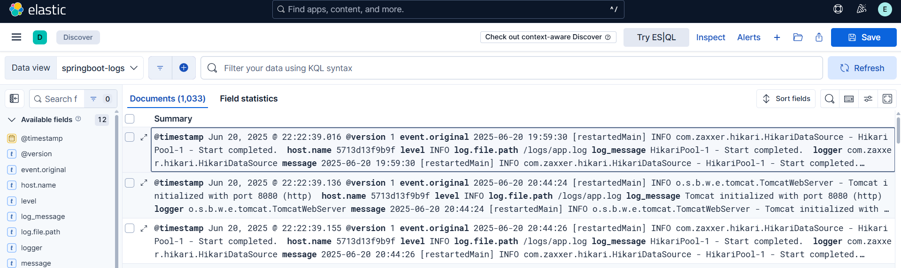

# Microservices Practice

This project demonstrates the practice of **Spring Boot Microservices**. The application consists of multiple microservices, with the use of a **service registry**, **API Gateway** for routing, **circuit breakers**, and **Micrometer** and **Zipkin** for distributed tracing.


## Project Structure

- **Microservice 1**: Exposed via API Gateway endpoint `http://localhost:8080/apiOne/getByAge/{age}`
- **Microservice 2**: Exposed via API Gateway endpoint `http://localhost:8080/apiTwo/test/{age}`

## Distributed Tracing with Micrometer & Zipkin

This project integrates **Micrometer** for metrics collection and **Zipkin** for distributed tracing.

### Starting Zipkin

To run Zipkin in Docker, use the following command:

```bash
docker run -d -p 9411:9411 openzipkin/zipkin
```

# Kafka Integration with Microservices

**Kafka Producer** is implemented in **Microservice 1**.  
**Kafka Consumer** is implemented in **Microservice 2**.

steps to up the docker compose file for kafka placed in deployment parent folder :
```bash
1)docker compose -f docker-compose.yml up
```
```bash
2)docker network create kafka-network
```
```bash
3)docker run -d --name zookeeper --network kafka-network -e ZOOKEEPER_CLIENT_PORT=2181 confluentinc/cp-zookeeper:latest
```
```bash
4)docker run -d --name kafka --network kafka-network -e KAFKA_ZOOKEEPER_CONNECT=zookeeper:2181 -e KAFKA_ADVERTISED_LISTENERS=PLAINTEXT://localhost:9092 -e KAFKA_BROKER_ID=1 -e KAFKA_OFFSETS_TOPIC_REPLICATION_FACTOR=1 confluentinc/cp-kafka:latest
```

### Redis Implementation (Redis-Practise Module)

1. **Start Redis container**:
    ```bash
    docker run --name my-redis -p 6379:6379 -d redis
    ```

2. **Access Redis CLI**:
    ```bash
    docker exec -it my-redis sh
    ```

3. **In Redis CLI**:
    ```bash
    redis-cli
    keys product:*
    FLUSHDB
    keys GetProduct:*
    keys *
    ```


In the **Product Service**, I have implemented caching. The first time a product is fetched using its ID, it will take around 10 seconds (due to a simulated delay). However, subsequent fetches for the same product will be much faster because the result is cached in Redis. I have set the cache expiration time to 25 seconds. So, if you try to fetch the same product within 25 seconds, it will return the cached result without hitting the database again.


#### Redis Cache config
```java
    @Bean
    public RedisCacheManager redisCacheManager(RedisConnectionFactory redisConnectionFactory) {
        
        RedisCacheConfiguration cacheConfiguration=RedisCacheConfiguration.defaultCacheConfig()
        .entryTtl(Duration.ofMillis(25000))
        .serializeValuesWith(RedisSerializationContext.SerializationPair
        .fromSerializer(new Jackson2JsonRedisSerializer<>(Product.class)));

        
        return RedisCacheManager.builder(redisConnectionFactory)
                .cacheDefaults(cacheConfiguration).build();

    }

```
#### Redis hash 

In product.java class I have used the redis hash to store the product details in redis cache and used ttl of 25 seconds for the cache to expire.

```java
@RedisHash(value = "product",timeToLive =25)
@NoArgsConstructor
@AllArgsConstructor
@Data
public class Product implements Serializable {

    @Id
    @Indexed
    private String id=UUID.randomUUID().toString();
    private String name;
    private double price;
```
**Note** : The TTL setting in the Redis configuration does not automatically delete individual Redis hash entries. Therefore, we have used the @RedisHash annotation with timeToLive set to 25 seconds in the Product class. This ensures that product details are stored in Redis with a TTL, allowing them to expire automatically after the specified duration.

## Prometheus ,Grafana , Loki Implementations

### 1. Start Docker Compose for Grafana and Prometheus

Navigate to the monitoring folder and run the following command to start the services:

   ```bash
   docker-compose up -d
   ```

### 2. Access Prometheus and Grafana

You can access Prometheus ,Grafana and Loki through the following ports:

- **Prometheus**: [http://localhost:9090](http://localhost:9090)
- **Grafana**: [http://localhost:3000](http://localhost:3000)
- **Loki**: [http://localhost:3100/metrics](http://localhost:3100/metrics)

### 3. Make sure to replace `localhost` with your server's IP address in prometheus.yml file in monitoring folder

### 4. Added the necessary data sources for both Prometheus and Loki in Grafana to view the metrics and logs.

## 🚀 Elasticsearch Implementation (Redis-Practice Module)

This module demonstrates how to integrate **Elasticsearch** into a Spring Boot application using a **single-node cluster** setup via Docker.

### 📦 Setup Elasticsearch with Docker

- To set up a local **Elasticsearch** instance using Docker, follow the official guide:

- 🔗 [Elasticsearch Docker Setup - Official Guide](https://www.elastic.co/docs/deploy-manage/deploy/self-managed/install-elasticsearch-docker-basic)

- Dont forget to add the certificate to the jdk cacerts file in your local machine.
```bash
keytool -import -alias elasticsearch -file /path/to/your/certificate.crt -keystore $JAVA_HOME/lib/security/cacerts
```

### 📝 Important Note

- When defining an `id` in the entity class, it’s recommended to use a **String** data type instead of **int**. This is because Elasticsearch will automatically create an ID for the document if the `id` field is left as a String.
- You can view all the stored indices by visiting the following URL in your browser:
[https://localhost:9200/person/_search?pretty&q=*:*](
https://localhost:9200/person/_search?pretty&q=*:*)

---

## 📋 Code Example

### Entity Class (Person)

In your `Person` class, use the `@Document` annotation to define the Elasticsearch index and map the fields.

```java
@Document(indexName = "person")
@Getter
@Setter
@AllArgsConstructor
@NoArgsConstructor
@ToString
public class Person {

    @Id
    private String id; // Use String for id to let Elasticsearch auto-generate it
    private String name;
    private String email;

}
```
Sample Json output of all stored values in elastic and we can see below the autogenerated id values.

```json
{
    "content": [
       
        {
            "id": "dGJ9xZYBZpmfKikCjXbz",
            "name": "jitendra",
            "email": "=jitendra@email.com"
        },
        {
            "id": "dWJ9xZYBZpmfKikCvXYU",
            "name": "chinna",
            "email": "chinna@email.com"
        }
    ]
```
### 🗄️ Dual Database Strategy

- **Person**: Stored in MySQL
- **PersonElastic**: Stored in Elasticsearch

 When saving a record, persist it in both databases.However all search operations are performed only on the `PersonElastic` entity in Elasticsearch.
---
### 📊 Kibana Setup for Elasticsearch (Docker)

To run **Kibana** with Elasticsearch using Docker, follow the official guide:  
[Install Kibana with Docker - Elastic Docs](https://www.elastic.co/docs/deploy-manage/deploy/self-managed/install-kibana-with-docker)

#### 🚀 Quick Start

1. **Start Elasticsearch and Kibana containers**  
   Follow the steps in the [official guide](https://www.elastic.co/docs/deploy-manage/deploy/self-managed/install-kibana-with-docker) to get both services running.

2. **Access Kibana**  
   - Open your browser and navigate to:  
     ```
     http://localhost:5601
     ```
   - When prompted, enter the **enrollment token** and the `elastic` username and password generated by Elasticsearch.


#### 🗂️ Create a Data View

After logging in:

1. **Create a Data View**  
   - Go to **Management** → **Stack Management** → **Data Views**.
   - Click **Create data view**.
   - Enter your index pattern (e.g., `person*` to match all indices starting with "person").
   - Complete the setup.

2. **Explore Your Data**  
   - Navigate to **Discover** in Kibana.
   - Select your newly created data view.
   - You can now browse and search all documents related to your chosen index or pattern.

See Sample SS for the reference:



 
---
##  📦 **Logstash Setup**

Run logstash using the following docker command:

```bash
docker run --network=<network_name> -d \
  -v "<host_logs_dir>:/logs" \
  -v "<host_logstash_conf_path>:/usr/share/logstash/pipeline/logstash.conf" \
  -v "<host_ssl_cert_path>:/usr/share/logstash/config/httpcert.crt" \
  -p 5044:5044 \
  -p 5000:5000 \
  docker.elastic.co/logstash/logstash:<version>
```
Changes to made in the logstash.conf to read the logs from the file and send it to elasticsearch.

```conf
output {
  elasticsearch {
    hosts => ["https://<elastic_Search_Container_Ip>:9200"]
    index => "springboot-logs"
    user => "elastic"
    password => <elastic_password>
    ssl_enabled => true
    ssl_certificate_authorities => ["/usr/share/logstash/config/httpcert.crt"]

  }
}
```
See Sample SS for the reference:



# POINT TO NOTE
- Create a common network for Elastic Search, Kibana, and Logstash to allow them to communicate with each other.

  
---
## Task Progress Tracking

Here’s a summary of the tasks that have been successfully completed:

- **[Flyway Database Migration](https://github.com/jitendrapitchuka/flyway_example_sprringboot)**: ✅ Completed
- **Exception Handling in Spring Boot**(In MicroService-1): ✅ Completed
- **Environment-Specific Application Properties (dev, prod)** (Not included in this project): ✅ Completed
- **API Gateway Setup**: ✅ Completed
- **Microservices Communication (A calls B using RestTemplate and openFeign)**: ✅ Completed
- **Circuit Breakers Implementation**: ✅ Completed
- **Distributed Tracing with Micrometer & Zipkin (Spring Cloud Sleuth)**: ✅ Completed
- **Kafka Integration (Producer and Consumer)**: ✅ Completed
- **Redis Implementation (Caching in Product Service)**: ✅ Completed
- **Prometheus, Grafana and Loki Integration**(in Microservice-2):✅ Completed
- **Elastic-Search**(In Redis-Practise module Product entity):✅ Completed
- **Kibana Setup for Elasticsearch**(In Redis-Practise module Product entity): ✅ Completed
- **Logstash Setup**(In Redis-Practise module Product entity): ✅ Completed
